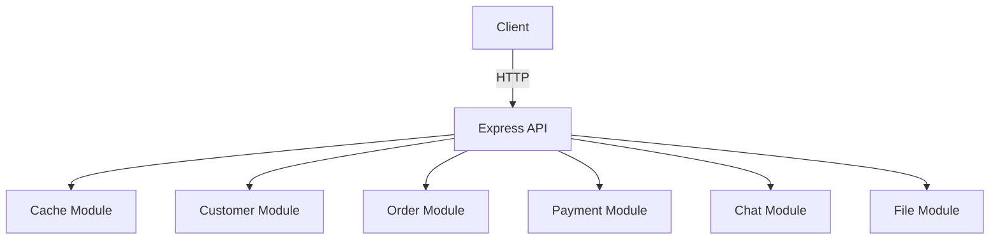

# Node.js Modular API Project

## Project Structure

```
src/
  cache/      # Caching logic and endpoints
  customer/   # Customer management
  order/      # Order processing
  payment/    # Payment handling
  chat/       # Chat functionality
  file/       # File upload/download
  app.js      # Main application entry point
```

## How It Works
- **Express.js** is used as the web framework.
- Each module (cache, customer, order, payment, chat, file) is separated into its own folder with its own router.
- All API endpoints are prefixed with `/api/{module}` (e.g., `/api/customer`).
- The main app imports and mounts each module's router.

## Security Considerations
- **Input Validation:** Always validate and sanitize user input to prevent injection attacks.
- **Authentication & Authorization:** Use JWT or OAuth for secure access to endpoints.
- **HTTPS:** Deploy behind HTTPS to encrypt data in transit.
- **CORS:** Configured to control which domains can access the API.
- **Rate Limiting:** Prevent abuse by limiting repeated requests.
- **Environment Variables:** Sensitive data (like API keys) are stored in `.env` files, not in code.
- **Error Handling:** Do not leak sensitive error details to clients.

## Example Endpoints
- `GET /api/cache/` — Cache operations
- `GET /api/customer/` — Customer management
- `GET /api/order/` — Order processing
- `GET /api/payment/` — Payment handling
- `GET /api/chat/` — Chat operations
- `GET /api/file/` — File operations

## Architecture Diagram



## Presentation Summary
- **Modular Design:** Each business domain is isolated for maintainability and scalability.
- **Security:** Follows best practices for API security.
- **Extensible:** New modules can be added easily.
- **Separation of Concerns:** Each module handles its own logic and routing.
